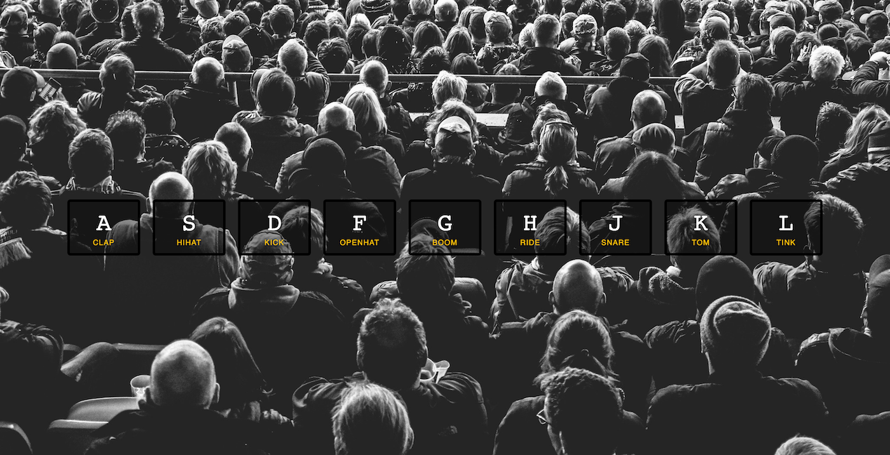

# Drum Kit

## Table of contents

- [Overview](#overview)
  - [Live Preview](#Live-preview)
  - [Screenshot](#screenshot)
- [My process](#my-process)
  - [Built with](#built-with)
  - [What I learned](#what-i-learned)
  - [Acknowledgements](#acknowledgements)

## Overview

### Live preview

[Click Here](https://bhornbhaya.github.io/the-pig-game/)

### Screenshot

### Desktop Version

## My process

### Built with

- HTML5
- CSS
- Javascript

### What I learned

- DOM and DOM Manipulation
- Selecting and manipulating elements
- Handling click events
- Refactoring code: The DRY principle

### Acknowledgements

This exercise is a part of Wes Bos’s JavaScript30 program

Coded by [me](https://www.linkedin.com/in/bhornbhaya/)
